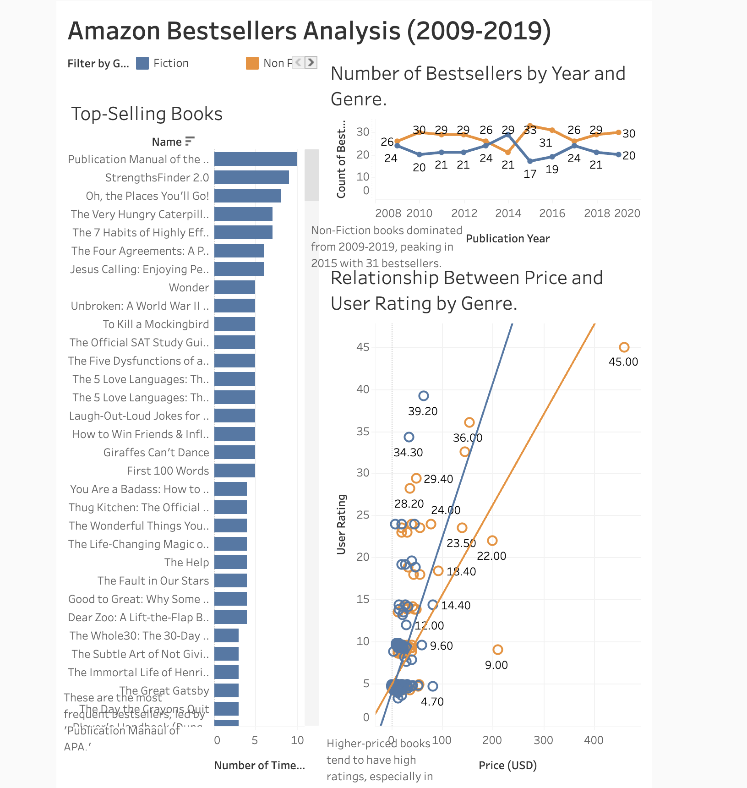

# 📂 Heritage Adigun's Data Analytics Portfolio

Welcome to my portfolio! Here, you'll find projects showcasing my skills in **R, SQL, and data analysis**.

## 🔍 Featured Projects

### [Bellabeat Smartwatch Case Study](./Bellabeat-Case-Study)
- **Objective:** Analyzed Fitbit user data to optimize Bellabeat’s Time smartwatch marketing.
- **Key Insights:** Users are most active at **6-7 PM**, suggesting marketing for evening workouts.
- **Tools Used:** R (tidyverse, ggplot2)
- **[View Full Report](./Bellabeat-Case-Study/Bellabeat_Time.pdf)**

### 📊 Amazon Bestsellers Analysis Dashboard

- **Objective:** Analyzed Amazon bestsellers from 2009–2019 to uncover trends in genres, pricing, and user ratings.
- **Key Insights:**
  - Non-Fiction books dominated sales during the decade, peaking in 2015.
  - Higher-priced books tend to have higher user ratings, especially in Non-Fiction.
  - "Publication Manual of the APA" appeared most frequently on the bestseller list.
- **Tools Used:** Tableau

[🔗 View Interactive Dashboard](https://public.tableau.com/views/AmazonBestsellersAnalysis/AmazonBestsellersDashboard?:language=en-US&publish=yes&:sid=&:redirect=auth&:display_count=n&:origin=viz_share_link)

---

## 🚀 About Me
I’m a **data analyst** with expertise in **R, SQL, and project management**. My goal is to use data to drive meaningful insights in business and technology.

💼 Open to opportunities in **data analytics, business intelligence, and tech consulting**.

📩 Connect with me on **[LinkedIn](https://www.linkedin.com/in/heritage-adigun/)** or check out my **[GitHub Projects](https://github.com/heritage-ad)**.

